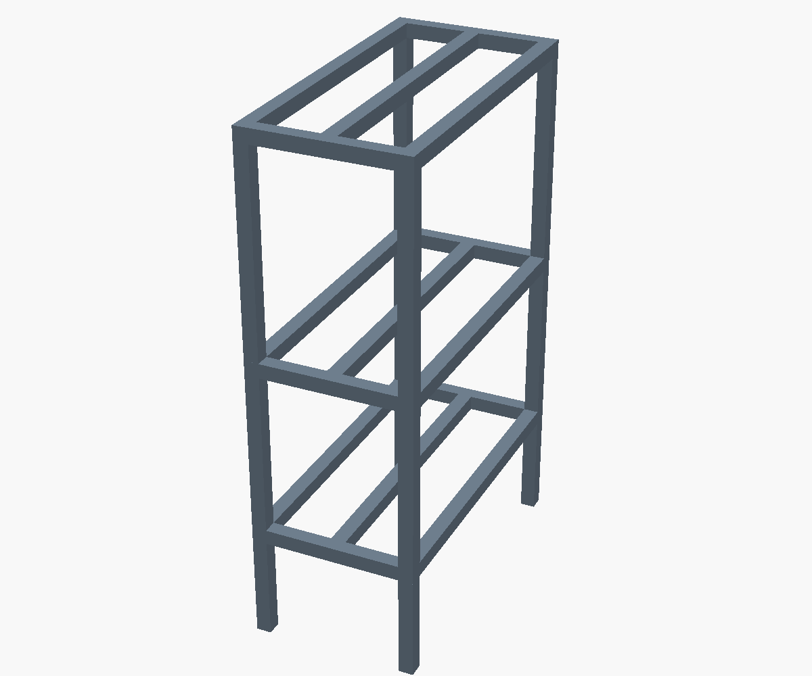

# 3D-модель стеллажа

3D-модель 3-ярусного открытого металлического стеллажа (стойки), воссозданная
по эскизу от руки.



## Габариты (по эскизу)

| Параметр | Значение |
|---|---|
| Ширина (фронт) | **280 мм** («28 см, не больше») |
| Глубина (бок) | **550 мм** («55 см») |
| Нижняя полка от пола | **200 мм** («20») |
| Средняя полка | **500 мм** (+300, «30») |
| Верхняя полка | **875 мм** (+375, «35–40», взято среднее) |
| Профиль трубы | **25 × 25 мм** (квадрат) |
| Полки | рейки из той же трубы 25×25 (без решётки) |
| Рейки | идут вдоль длины (550 мм), на всю ширину полки — горшки стоят на сплошных рейках |
| Просвет между рейками | ~**100 мм** — свет проходит на нижние полки |

Все размеры в модели заданы параметрически — их легко изменить в начале файла
`shelf_rack.scad`. Параметр `slat_gap` задаёт желаемый просвет между рейками
полки (количество реек подбирается автоматически под равные зазоры). Параметр
`slats_lengthwise` задаёт направление реек: `true` — вдоль длины (по умолчанию),
`false` — поперёк.

## Файлы

| Файл | Описание |
|---|---|
| `shelf_rack.scad` | Исходная параметрическая модель (OpenSCAD) |
| `shelf_rack.stl` | Готовая 3D-модель (STL) для печати / импорта |
| `viewer.html` | Интерактивный просмотр в браузере (Three.js) |
| `preview_*.png` | Рендеры (изометрия, фронт, бок, сверху) |

## Просмотр

**В браузере (интерактивно):** запустите локальный сервер из этой папки и
откройте `viewer.html` (нужен сервер, чтобы браузер мог загрузить `.stl`):

```bash
cd 3d-model
python3 -m http.server 8000
# затем откройте http://localhost:8000/viewer.html
```

**STL:** открывается в любом слайсере/просмотрщике (Cura, PrusaSlicer,
Windows 3D Viewer, Fusion 360 и т. д.).

## Изменение модели

Откройте `shelf_rack.scad` в [OpenSCAD](https://openscad.org/) и
отредактируйте параметры вверху файла. Чтобы заново сгенерировать STL и
рендеры из командной строки:

```bash
# STL
openscad -o shelf_rack.stl shelf_rack.scad

# Рендер изображения
openscad -o preview_iso.png --imgsize=1200,1000 --viewall --autocenter \
  --camera=0,0,0,62,0,25,0 --colorscheme=Tomorrow shelf_rack.scad
```
